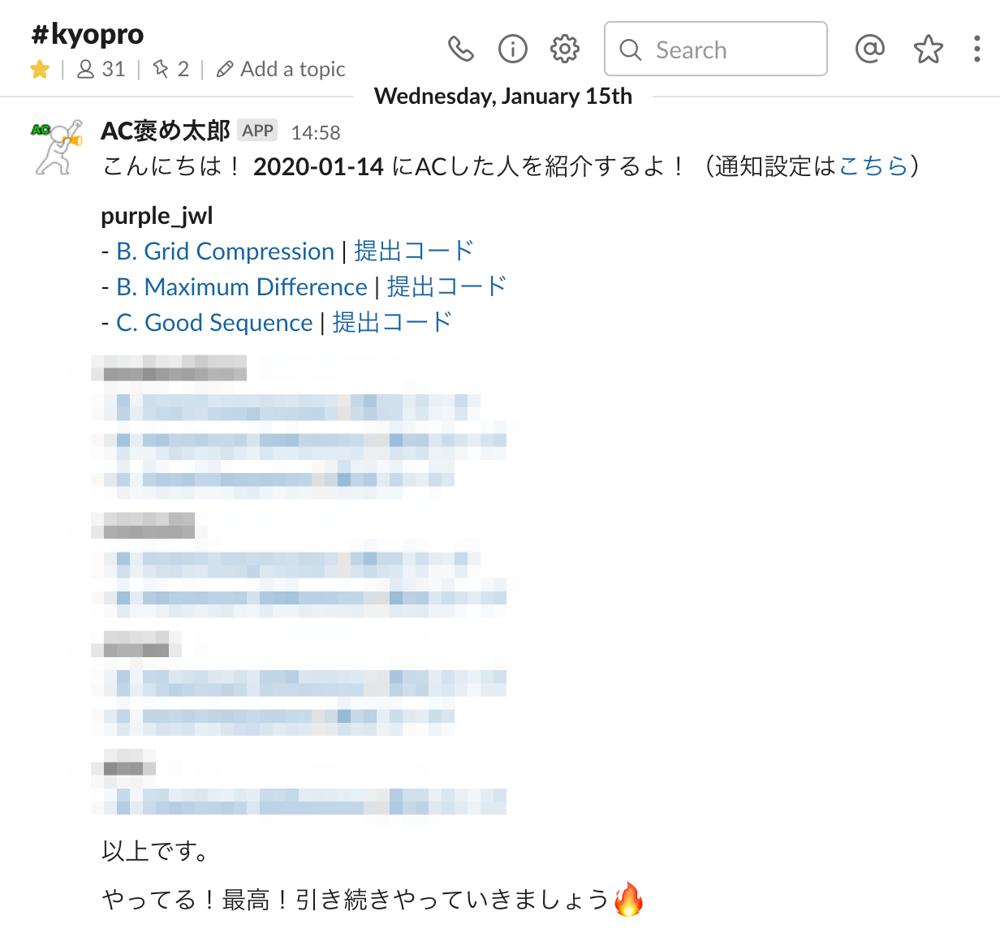

# AtCoder Daily AC Checker (a.k.a AC褒め太郎)

[AtCoder](https://atcoder.jp/)で前日にACした人をSlack上で褒める（紹介する）ためのツールです。



## セットアップ

1. デプロイします。
  ```
  $ npm install
  $ npx clasp login
  $ npx clasp create --rootDir ./src
  $ npx clasp push
  ```

1. スプレッドシートを作成し、シート名を"管理表"にします
  - シートは1列（A列）のみ使用します
  - 1行目はヘッダー行とし、2行目以降にAtCoder ID（ユーザー名）を入力してください
    - （例）[このアカウント](https://atcoder.jp/users/purple_jwl)を対象にする場合、`purple_jwl`を入力してください

1. Google Apps Scriptのエディタ画面で以下の環境変数を設定します（ファイル > プロジェクトのプロパティ > スクリプトのプロパティ）
  - WEBHOOK_URL : SlackのIncoming Webhook URL
  - SHEET_ID : 先ほど作成したスプレッドシートのシートID

1. トリガーを設定します（編集 > 現在のプロジェクトのトリガー > トリガーを追加）
  - main関数を指定してください

## 注意

このツールでは @kenkoooo 氏の[API](https://github.com/kenkoooo/AtCoderProblems)を使用し、AtCoderに関する情報を取得しています。スクリプトの短時間での連続実行などはお控えくださいますようお願いいたします。
