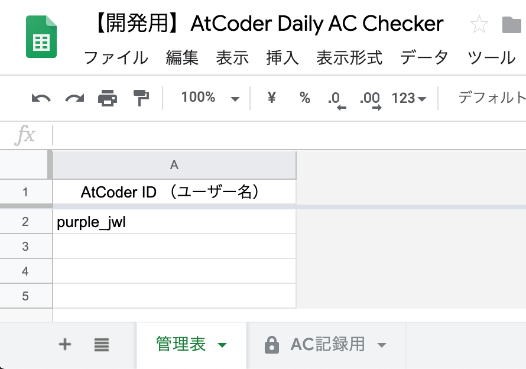
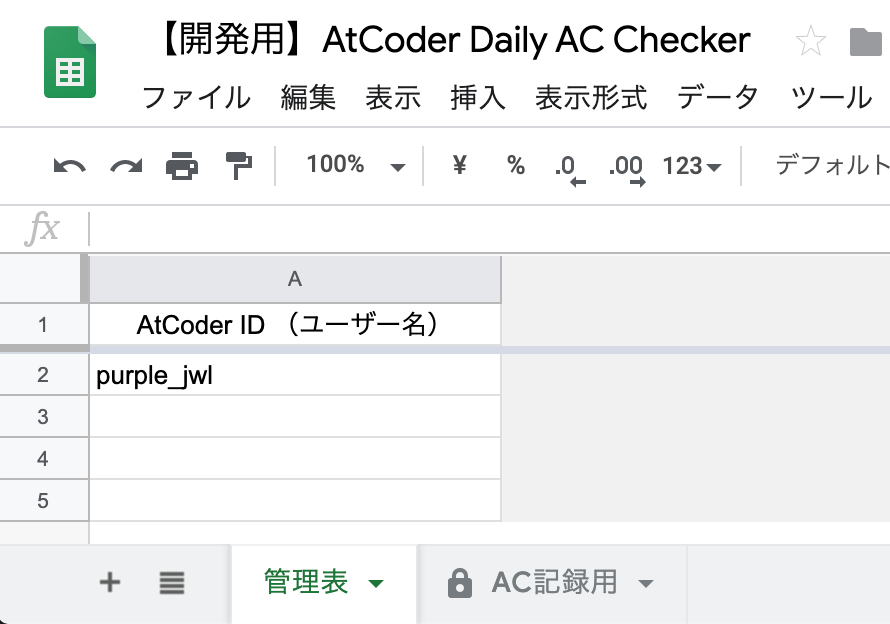

# AtCoder Daily AC Checker (a.k.a AC褒め太郎)

[AtCoder](https://atcoder.jp/)で前日にACした人やたくさんACしている人をSlack上で褒める（紹介する）ためのツールです。



## セットアップ

- デプロイします
  ```sh
  $ npm install
  $ npx clasp login
  $ npx clasp create --rootDir ./src
  $ npx clasp push
  ```
- スプレッドシートを作成します
  - ファイル名は何でも良いです
- シートを2枚作成します
  - 1枚目のシート名は __管理表__ としてください
    - シートは1列（A列）のみ使用します
    - 1行目はヘッダー行とし、2行目以降にAtCoder ID（ユーザー名）を入力してください
      - （例）[このアカウント](https://atcoder.jp/users/purple_jwl)を対象にする場合、`purple_jwl`を入力してください
  - 2枚目のシート名は __AC記録用__ としてください
    - _N_ ACした人を褒めるために使用します（複数設定可）
    - 1行目をヘッダー行として、2列目（B列）以降に通知したいAC数を入力してください
      - （例）10ACした人、50ACした人、100ACした人を褒める場合、2列目に `10` 、3列目に `50` 、4列目に `100` を入力してください
    - 1列目（A列）には1枚目のシートで入力したAtCoder IDをスクリプト側で勝手に入力するようにしているので入力は不要です
    - 初期設定（通知したいAC数を入力する）後は基本的にこのシートは人間が触る必要がないので、シート保護などしておくとよいでしょう

  | （例）管理表 | （例）AC記録用 |
  | :-: | :-: |
  |  |  |
- Google Apps Scriptのエディタ画面で以下の環境変数を設定します（ファイル > プロジェクトのプロパティ > スクリプトのプロパティ）
  - WEBHOOK_URL : SlackのIncoming Webhook URL
  - SHEET_ID : 先ほど作成したスプレッドシートのシートID
- トリガーを設定します（編集 > 現在のプロジェクトのトリガー > トリガーを追加）
  - main関数を指定してください

## 注意

このツールでは @kenkoooo 氏の[API](https://github.com/kenkoooo/AtCoderProblems)を使用し、AtCoderに関する情報を取得しています。スクリプトの短時間での連続実行などはお控えくださいますようお願いいたします。
